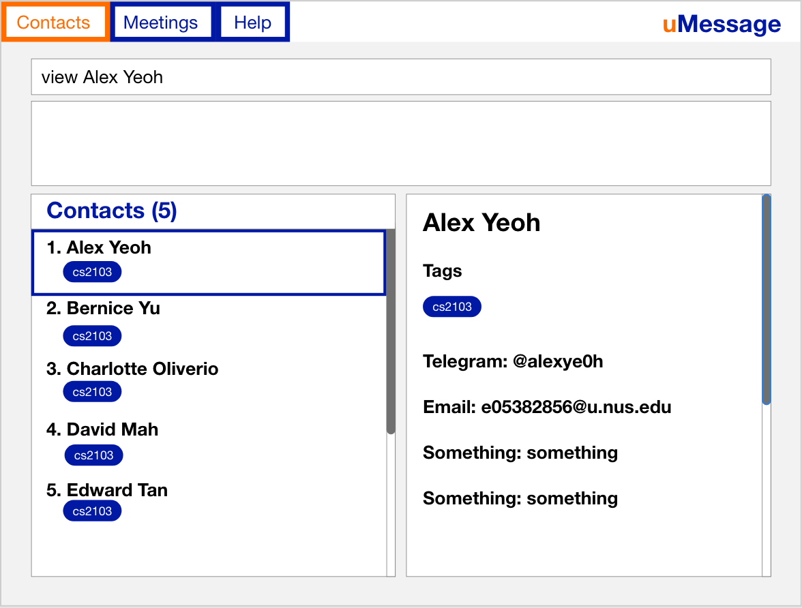
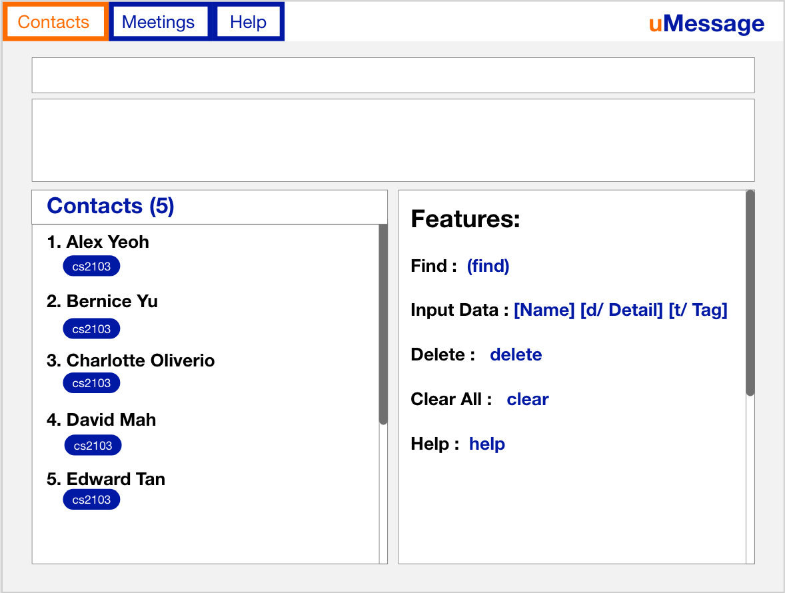
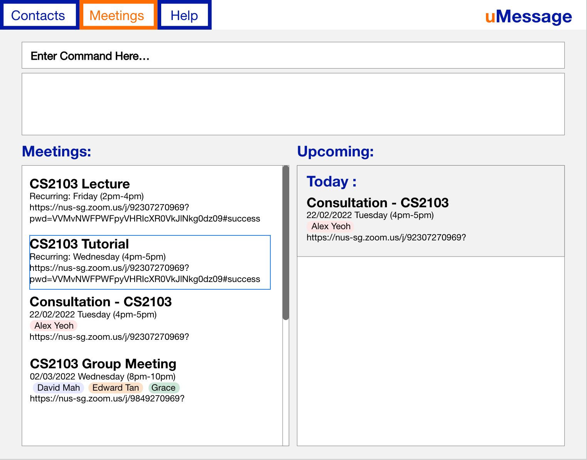

* This is **an app that helps university students manage their contacts and meetings.**. It is optimized for keyboard users. 
  Example usages:
  * as a consolidated place to store information
  * managing contacts from modules and CCAs
  * managing meeting links for various platforms.

   
* The project simulates an ongoing software project for a desktop application (called _AddressBook_) used for managing contact details.
  * It is **written in OOP fashion**. It provides a **reasonably well-written** code base **bigger** (around 6 KLoC) than what students usually write in beginner-level SE modules, without being overwhelmingly big.
  * It comes with a **reasonable level of user and developer documentation**.
* It is named `uMessage` because it was initially created as part of the `NUS` ecosystem (`uNivUS`, `NextbUS`, ...).
* This project is based on the AddressBook-Level3 project created by the [SE-EDU initiative](https://se-education.org).
