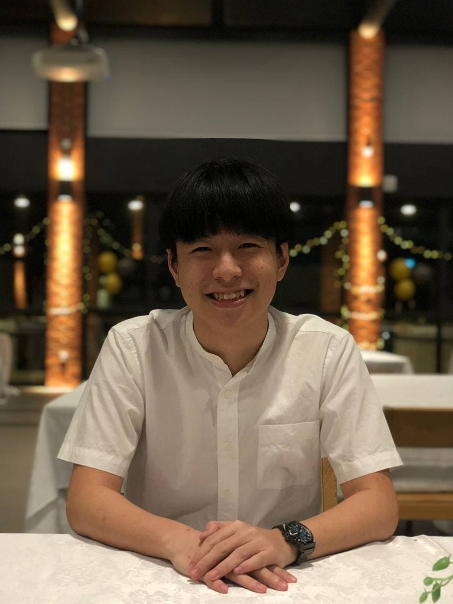
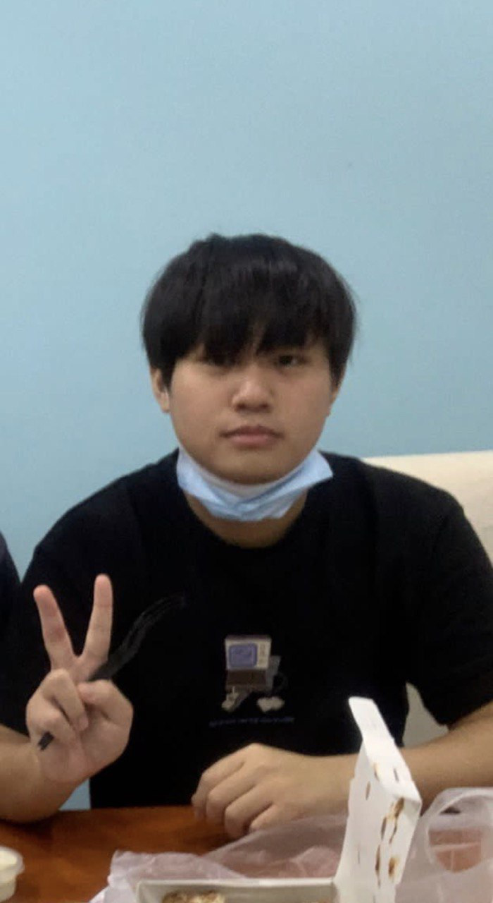

We are a team based in the [School of Computing, National University of Singapore](http://www.comp.nus.edu.sg).

## Our Team

### Ong Weng Qi

[[github](https://github.com/chriswengqi)] [[portfolio](team/chriswengqi.md)]
- Role: Team Lead
- Responsibilities: Deliverables and Deadlines

### Kaaviya Selvam

[[github](http://github.com/kavxya)] [[portfolio](team/kavxya.md)]

* Role: Documentation
* Responsibilities: UI design

### Chow Yung Jie Kenneth

[[github](http://github.com/reignnz)] [[portfolio](team/reignnz.md)]

* Role: Testing

### Wong Chee Hong

[[github](http://github.com/cheehongw)] [[portfolio](team/cheehongw.md)]

* Role: Code Quality

### Wu Zihao

[[github](http://github.com/zihaowrez)] [[portfolio](team/zihaowrez.md)]

* Role: Integration
