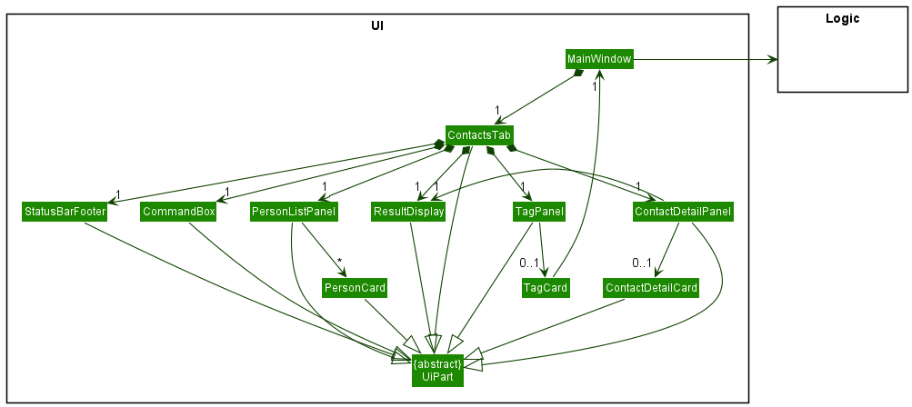
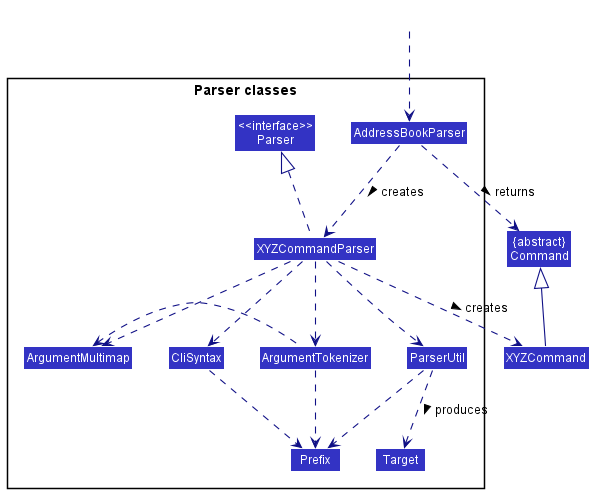
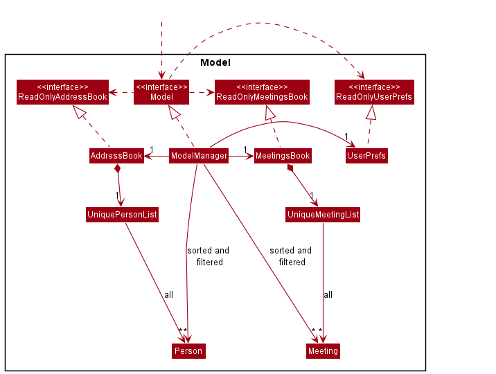
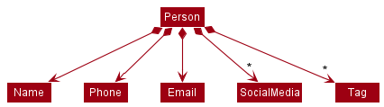
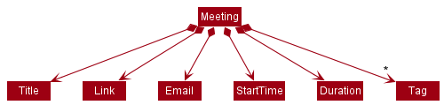
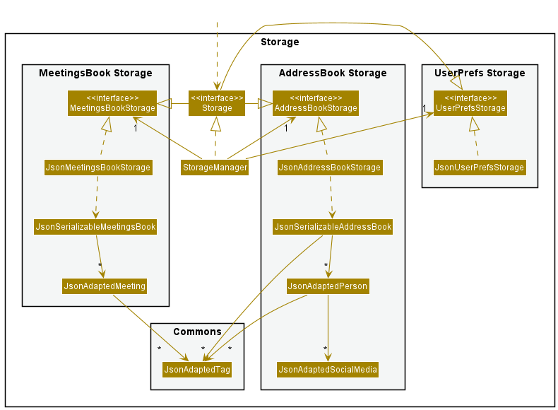
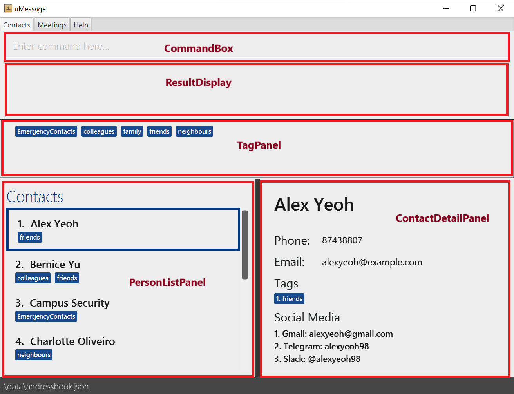
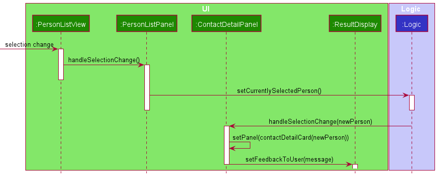
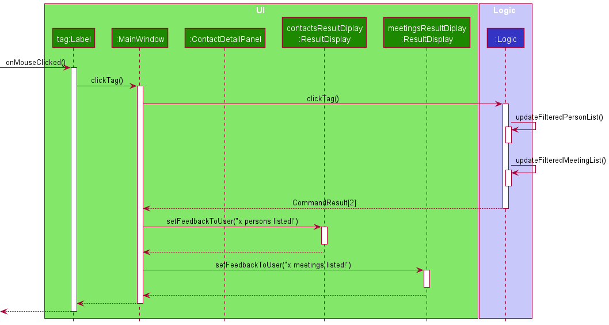
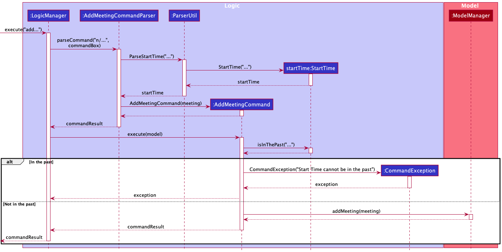

* Table of Contents
  {:toc}

--------------------------------------------------------------------------------------------------------------------

## **Acknowledgements**

* This project is based on the AddressBook-Level3 project created by the SE-EDU initiative.
* The following libraries were also used in the project.
    - JavaFX for the Graphical User Interface (GUI).
    - Jackson for JSON Parsing.
    - JUnit5 for Testing.
    - [markdown-javafx-renderer](https://github.com/JPro-one/markdown-javafx-renderer) for rendering the markdown.

--------------------------------------------------------------------------------------------------------------------

## **Setting up, getting started**

Refer to the guide [_Setting up and getting started_](SettingUp.md).

--------------------------------------------------------------------------------------------------------------------

## **Design**

:bulb: **Tip:** The `.puml` files used to create diagrams in this document can be found in the [diagrams](https://github.com/se-edu/addressbook-level3/tree/master/docs/diagrams/) folder. Refer to the [_PlantUML Tutorial_ at se-edu/guides](https://se-education.org/guides/tutorials/plantUml.html) to learn how to create and edit diagrams.

### Architecture

The ***Architecture Diagram*** given above explains the high-level design of the App.

Given below is a quick overview of main components and how they interact with each other.

**Main components of the architecture**

**`Main`** has two classes called [`Main`](https://github.com/se-edu/addressbook-level3/tree/master/src/main/java/seedu/address/Main.java) and [`MainApp`](https://github.com/se-edu/addressbook-level3/tree/master/src/main/java/seedu/address/MainApp.java). It is responsible for,
* At app launch: Initializes the components in the correct sequence, and connects them up with each other.
* At shut down: Shuts down the components and invokes cleanup methods where necessary.

[**`Commons`**](#common-classes) represents a collection of classes used by multiple other components.

The rest of the App consists of four components.

* [**`UI`**](#ui-component): The UI of the App.
* [**`Logic`**](#logic-component): The command executor.
* [**`Model`**](#model-component): Holds the data of the App in memory.
* [**`Storage`**](#storage-component): Reads data from, and writes data to, the hard disk.

**How the architecture components interact with each other**

The *Sequence Diagram* below shows how the components interact with each other for the scenario where the user issues the command `delete 1`.

Each of the four main components (also shown in the diagram above),

* defines its *API* in an `interface` with the same name as the Component.
* implements its functionality using a concrete `{Component Name}Manager` class (which follows the corresponding API `interface` mentioned in the previous point.

For example, the `Logic` component defines its API in the `Logic.java` interface and implements its functionality using the `LogicManager.java` class which follows the `Logic` interface. Other components interact with a given component through its interface rather than the concrete class (reason: to prevent outside component's being coupled to the implementation of a component), as illustrated in the (partial) class diagram below.

The sections below give more details of each component.

### UI component

The **API** of this component is specified in [`Ui.java`](https://github.com/se-edu/addressbook-level3/tree/master/src/main/java/seedu/address/ui/Ui.java)

The UI consists of a `MainWindow` that is made up of three tabs: `Contacts`, `Meetings`, and `Help`.

Each tab has different components. `Meetings` has a similar structure as `Contacts` except that there are no `MeetingDetailPanel` and `MeetingDetailCard`. `Help` contains only a `MarkdownView`.

All components and the `MainWindow` inherit from the abstract `UiPart` class which captures the commonalities between classes that represent parts of the visible GUI.

The `UI` component uses the JavaFx UI framework. The layout of these UI parts are defined in matching `.fxml` files that are in the `src/main/resources/view` folder. For example, the layout of the [`MainWindow`](https://github.com/se-edu/addressbook-level3/tree/master/src/main/java/seedu/address/ui/MainWindow.java) is specified in [`MainWindow.fxml`](https://github.com/se-edu/addressbook-level3/tree/master/src/main/resources/view/MainWindow.fxml)

The `UI` component,

* executes user commands using the `Logic` component.
* listens for changes to `Model` data so that the UI can be updated with the modified data.
* keeps a reference to the `Logic` component, because the `UI` relies on the `Logic` to execute commands.
* depends on some classes in the `Model` component, as it displays `Person` object residing in the `Model`.

### Logic component

**API** : [`Logic.java`](https://github.com/se-edu/addressbook-level3/tree/master/src/main/java/seedu/address/logic/Logic.java)

Here's a (partial) class diagram of the `Logic` component:

How the `Logic` component works:
1. When `Logic` is called upon to execute a command, it uses the `AddressBookParser` class to parse the user command.
1. This results in a `Command` object (more precisely, an object of one of its subclasses e.g., `AddCommand`) which is executed by the `LogicManager`.
1. The command can communicate with the `Model` when it is executed (e.g. to add a person).
1. The result of the command execution is encapsulated as a `CommandResult` object which is returned back from `Logic`.

The Sequence Diagram below illustrates the interactions within the `Logic` component for the `execute("delete 1")` API call.

:information_source: **Note:** The lifeline for `DeleteCommandParser` should end at the destroy marker (X) but due to a limitation of PlantUML, the lifeline reaches the end of diagram.

Here are the other classes in `Logic` (omitted from the class diagram above) that are used for parsing a user command:

How the parsing works:
* When called upon to parse a user command, the `AddressBookParser` class creates an `XYZCommandParser` (`XYZ` is a placeholder for the specific command name e.g., `AddCommandParser`) which uses the other classes shown above to parse the user command and create a `XYZCommand` object (e.g., `AddCommand`) which the `AddressBookParser` returns back as a `Command` object.
* All `XYZCommandParser` classes (e.g., `AddCommandParser`, `DeleteCommandParser`, ...) inherit from the `Parser` interface so that they can be treated similarly where possible e.g, during testing.

### Model component
**API** : [`Model.java`](https://github.com/se-edu/addressbook-level3/tree/master/src/main/java/seedu/address/model/Model.java)

The `Model` component,

* stores the address book data i.e., all `Person` objects and `Meeting` objects (which are contained in a `UniquePersonList` object and `UniqueMeetingList` object respectively).
* stores the currently 'selected' `Person` objects (e.g., results of a search query) as a separate _filtered and sorted_ list which is exposed to outsiders as an unmodifiable `ObservableList<Person>` that can be 'observed' e.g. the UI can be bound to this list so that the UI automatically updates when the data in the list change.
  * the same is done for `Meeting` objects.v
* stores a `UserPref` object that represents the user’s preferences. This is exposed to the outside as a `ReadOnlyUserPref` objects.
* does not depend on any of the other three components (as the `Model` represents data entities of the domain, they should make sense on their own without depending on other components)

Internally, the `Model` component also contains other classes that model the attributes of `Person` and `Meeting`, as shown:

The `Person` class:
 

The `Meeting` class:
 

:information_source: **Note:** An alternative (arguably, a more OOP) model is given below. It has a `Tag` list in the `AddressBook`, which `Person` references. This allows `AddressBook` to only require one `Tag` object per unique tag, instead of each `Person` needing their own `Tag` objects. 

### Storage component

**API** : [`Storage.java`](https://github.com/se-edu/addressbook-level3/tree/master/src/main/java/seedu/address/storage/Storage.java)

The `Storage` component,
* can save address book data, meetings book data and user preference data in json format, and read them back into corresponding objects.
* inherits from `AddressBookStorage`, `MeetingsBookStorage` and `UserPrefStorage`, which means it can be treated as any one (if only the functionality of only one is needed).
* depends on some classes in the `Model` component (because the `Storage` component's job is to save/retrieve objects that belong to the `Model`)

### Common classes

Classes used by multiple components are in the `seedu.addressbook.commons` package.

--------------------------------------------------------------------------------------------------------------------

## **Implementation**

This section describes some noteworthy details on how certain features are implemented or any features that we have in mind.

|Overview                                                                     |
|-----------------------------------------------------------------------------|
|[Specifying targets by name or index](#specifying-targets-by-name-or-index)  |
|[Split-panel display](#split-panel-display)                                  |
|[Clickable Tags](#clickable-tags)                                            |
|[Dynamic Command Text Field](#dynamic-command-text-field)                    |
|[Copy Feature](#copy-feature)                                                |
|[Adding Meetings](#adding-meetings)                                          |
|[[Proposed] Undo/redo feature](#proposed-undoredo-feature)                   |

-------------------------------------------------

### Specifying targets by name or index

uMessage allows users to perform certain indexed-based operations by specifying the index of the contact/meeting in the application. However, it is noted that users may find referring to the contact/meeting **by name** to be more natural, and hence uMessage also exposes certain indexed based operations to work with names as well. Some examples of indexed-based operations include:

- Adding/removing new tags from a particular person in the list.
- Deleting a person/meeting from the list.
- Adding/removing new social media information from a person in the list.

The syntax of these commands are typically:
`<command_word> <INDEX or NAME> <relevant_options>`

To reduce code duplication and to differentiate between `INDEX` and `NAME`, a `Target` class is created to handle the parsing of the `INDEX/NAME` string, and commands that take in a `Index`/`Name` instance will now take in a `Target` instance instead.

At parsing time, before the command instances are instantiated, a `Target` instance is instantianted with the user input. Internally, the class checks first if the input is a valid `Index`, failing which, it checks if it is a valid `Name`. If it fails both checks, then the Target class will throw a `ParseException`, to be caught by `execute`.

At this point, note that certain invalid indices are still considered valid names since names are allowed to be alphanumeric. These are the string representations of `0` and any integer greater than `MAX_INT`. 

To prevent prematurely rejecting these strings as invalid indices, the validation for these input class will be deferred to command execution time, where the string is checked against the existing list of persons/meetings. If no person/meeting exists with the same name, then these set of inputs are treated as an invalid index and a `CommandException` is thrown accordingly.

----------------------

### Split-panel display

uMessage has a split view design for the contacts tab, as seen in the diagram above. On the top, we have a `ResultDisplay`, 
which displays the result of various commands and actions performed on the application. On the left, there is a UI component `PersonListPanel` where users can choose and select from the list of contacts available. 
On the right, users can see expanded, detailed information about the currently selected user, in a UI component called `ContactDetailPanel` and this panel changes based on who is currently selected on the left.

Internally, `ContactDetailPanel` observes a `SimpleObjectProperty<Person> currentlySelectedPerson` observable in the `ModelManager` object, and will update to display the information of the new `Person` whenever the value in the observable changes. 

There are only a few situations that can update the observable:
1. The user enters a `view INDEX` command through the command box.
2. The user changes what they select on the `PersonListPanel` on the left.

In the first case, the `view` command will retrieve the `Person` at the specified `INDEX` of the `ListView`, and then set this `Person` object as the new value for `SimpleObjectProperty<Person>`, and also update the `ResultDisplay` as well.

In the second case, the `ListView` within `PersonListPanel` has an inbuilt [Selection API](https://docs.oracle.com/javase/8/javafx/api/javafx/scene/control/ListView.html#:~:text=ListView%20Selection%20/%20Focus%20APIs) provided by the javafx library itself. This exposes an observable which contains the currently selected item of the `ListView`. `PersonListPanel` listens for changes to this value, and updates the `SimpleObjectProperty<Person>` in `ModelManager` whenever the selector on the `ListView` changes. 

<!-- @@author zihaowrez -->

When the user clicks a contact in the list, the detailed information will be displayed in the `ContactDetailPanel`, and the message in the `ResultDisplay` will be updated.

The `ContactDetailPanel` is responsible for informing the user through the corresponding `ResultDisplay` when the details have been shown successfully.

--------------------------------

### Clickable tags

When the user clicks a tag in the `TagPanel`, both the contact list and the meeting list will be filtered: only items that has the tag will be displayed. The number of matching items will then be updated in both `contactsResultDisplay` and `meetingsResultDisplay`.

This implementation helps the user to filter both contacts and meetings by tag easily.

Since the effect of clicking a tag is global, each tag (displayed using a `Label`) will call the `clickTag` method in `MainWindow`. The `clickTag` method is then responsible for calling `Logic` to update the filtered list and updating both `ResultDisplay`s when filtering is done.

-----------------

<!-- @@author reignnz -->
### Dynamic Command Text Field

#### Implementation
This implementation involves enabling the CommandTextField to read input as it is typed in the Command Line Interface (CLI). In the `CommandBox.java`, a listener function named handleDynamicInput(), reads the user input at each deletion or addition of the command in the CLI and calls `MainWindow#executeCommand`. It passes the command inputted by the user with the string "dynamic" concatted to the front, and a reference of itself (a CommandBox object).

The user input and instance of commandBox object is then passed to `LogicManager#execute` and subsequently `AddressBookParser#parseCommand` and `FindCommandParser#parse(arguments)`.

The above is assuming that the user inputs a string not included in the list of commands: “add”, “delete”, “list”, “find”, “view”, “edit”, "copy", "clear", "exit", "help".

#### Alternatives considered
* **Alternative 1 (current choice):** Continue to enable logging even during dynamic searching
    * Pros: No changes needed.
    * Cons: May have performance issues in terms of responsiveness.

-------------------------------

### Copy feature

#### Implementation
The copy mechanism is facilitated by `ClipboardManager`. It implements the following operation of copying the `Person` to the clipboard.

These operations are exposed in the `Model` interface as `Model#copyPerson()`.

Given below is an example usage scenario and how the copy mechanism behaves.

Step 1. The user launches the application.

Step 2. The user call the inputs copy [PERSON]

Step 3. The `CopyCommandParser` implements `Parser<CopyCommand>` parses the command and initalizes the CopyCommand with the name of the [PERSON]

Step 4. Finally the copy command is executed and the `ClipboardManager#copy` is called from the model.

#### Design Considerations:
**Aspect: Ease of copying data from uMessage:**

* **Alternative 1 (current choice):** Saves the entire contact book.
    * Pros: Easy to implement.
    * Cons: User may have to manually delete unwanted information from the contact.

* **Alternative 2:** Individual copy command to copy individual information stored in the contact
    * Pros: Will be easier for the user to copy information needed.
    * Cons: There must be an additional input from the user after the `copy` command with the field name.

_{more aspects and alternatives to be added}_

--------------------------------------------------

### Adding Meetings 

In our meetings tab, users can store information about meetings. Meetings consist of the following
information: 
1. Meeting Title
2. Meeting Link 
3. Start Time
4. Duration 

#### Implementation
The `Meeting.java` class contains a reference to five separate classes, each of which encapsulate the information 
about Meetings mentioned above. The `Title.java` class and `Duration.java` class stores the title and 
duration of a meeting respectively. The `Title.java` class simply stores the title as a `String` while the 
`Duration` class stores the duration as an `int`. The remaining two classes will be explained in more detail. 

Firstly, the `Link` class. In `Link.java`, a link/url for the meeting is stored as a String.
Following the international convention, the `Link` Validation Regex was structured such that the domain name can 
contain the English alphabet A-Z (not case-sensitive), the digits 0-9 and hyphens. However, hyphens cannot be added to 
the start or the end of a domain name. In addition, users will be required to add the protocol, 
`http://` or `https://` at the front of the link.

Secondly, the `StartTime.java` class. `StartTime` represents the starting date and time of a meeting. 
The time and date is contained within the Java Class `LocalDateTime`. When a meeting is created with the relevant start
time, a `StartTime` object will be created inside the `AddMeetingCommandParser#parse` regardless of whether the start 
time given is in the past, present or future.
Only when the `AddMeetingCommand#execute` method is executed, then the method `StartTime#isInThePast` will be invoked 
to check if the start/time given by the user is in the past or not by comparing it with `LocalDateTime#now`. 
If the start/time is in the past, a `CommandException` error will be thrown. 

Below is a diagram of the sequence of actions that occur when the user inputs a start time in the past and a 
start time not in the past:

<!-- @@author -->

-------------------------------------------
### \[Proposed\] Undo/redo feature

#### Proposed Implementation

The proposed undo/redo mechanism is facilitated by `VersionedAddressBook`. It extends `AddressBook` with an undo/redo history, stored internally as an `addressBookStateList` and `currentStatePointer`. Additionally, it implements the following operations:

* `VersionedAddressBook#commit()` — Saves the current address book state in its history.
* `VersionedAddressBook#undo()` — Restores the previous address book state from its history.
* `VersionedAddressBook#redo()` — Restores a previously undone address book state from its history.

These operations are exposed in the `Model` interface as `Model#commitAddressBook()`, `Model#undoAddressBook()` and `Model#redoAddressBook()` respectively.

Given below is an example usage scenario and how the undo/redo mechanism behaves at each step.

Step 1. The user launches the application for the first time. The `VersionedAddressBook` will be initialized with the initial address book state, and the `currentStatePointer` pointing to that single address book state.

Step 2. The user executes `delete 5` command to delete the 5th person in the address book. The `delete` command calls `Model#commitAddressBook()`, causing the modified state of the address book after the `delete 5` command executes to be saved in the `addressBookStateList`, and the `currentStatePointer` is shifted to the newly inserted address book state.

Step 3. The user executes `add n/David …​` to add a new person. The `add` command also calls `Model#commitAddressBook()`, causing another modified address book state to be saved into the `addressBookStateList`.

:information_source: **Note:** If a command fails its execution, it will not call `Model#commitAddressBook()`, so the address book state will not be saved into the `addressBookStateList`.

Step 4. The user now decides that adding the person was a mistake, and decides to undo that action by executing the `undo` command. The `undo` command will call `Model#undoAddressBook()`, which will shift the `currentStatePointer` once to the left, pointing it to the previous address book state, and restores the address book to that state.

:information_source: **Note:** If the `currentStatePointer` is at index 0, pointing to the initial AddressBook state, then there are no previous AddressBook states to restore. The `undo` command uses `Model#canUndoAddressBook()` to check if this is the case. If so, it will return an error to the user rather
than attempting to perform the undo.

The following sequence diagram shows how the undo operation works:

:information_source: **Note:** The lifeline for `UndoCommand` should end at the destroy marker (X) but due to a limitation of PlantUML, the lifeline reaches the end of diagram.

The `redo` command does the opposite — it calls `Model#redoAddressBook()`, which shifts the `currentStatePointer` once to the right, pointing to the previously undone state, and restores the address book to that state.

:information_source: **Note:** If the `currentStatePointer` is at index `addressBookStateList.size() - 1`, pointing to the latest address book state, then there are no undone AddressBook states to restore. The `redo` command uses `Model#canRedoAddressBook()` to check if this is the case. If so, it will return an error to the user rather than attempting to perform the redo.

Step 5. The user then decides to execute the command `list`. Commands that do not modify the address book, such as `list`, will usually not call `Model#commitAddressBook()`, `Model#undoAddressBook()` or `Model#redoAddressBook()`. Thus, the `addressBookStateList` remains unchanged.

Step 6. The user executes `clear`, which calls `Model#commitAddressBook()`. Since the `currentStatePointer` is not pointing at the end of the `addressBookStateList`, all address book states after the `currentStatePointer` will be purged. Reason: It no longer makes sense to redo the `add n/David …​` command. This is the behavior that most modern desktop applications follow.

The following activity diagram summarizes what happens when a user executes a new command:

#### Design considerations:

**Aspect: How undo & redo executes:**

* **Alternative 1 (current choice):** Saves the entire address book.
    * Pros: Easy to implement.
    * Cons: May have performance issues in terms of memory usage.

* **Alternative 2:** Individual command knows how to undo/redo by
  itself.
    * Pros: Will use less memory (e.g. for `delete`, just save the person being deleted).
    * Cons: We must ensure that the implementation of each individual command are correct.

--------------------------------------------------------------------------------------------------------------------

## **Documentation, logging, testing, configuration, dev-ops**

* [Documentation guide](Documentation.md)
* [Testing guide](Testing.md)
* [Logging guide](Logging.md)
* [Configuration guide](Configuration.md)
* [DevOps guide](DevOps.md)

--------------------------------------------------------------------------------------------------------------------

## **Appendix: Requirements**

<!-- @@author cheehongw -->
### Product scope

**Target user profile**:
A university student who:

* has a need to organise a significant number of contacts and meetings across various social media platforms
* prefer desktop apps over other types
* can type fast
* prefers typing to mouse interactions
* is reasonably comfortable using CLI apps

**Value proposition**: organise contacts and meetings across various social media platforms so that they can be retrieved more conveniently when needed

<!-- @@author -->

### User stories

Priorities: High (must have) - `* * *`, Medium (nice to have) - `* *`, Low (unlikely to have) - `*`

| Priority | As a …​                                                                 | I want to …​                                                  | So that I can…​                                                   |
|----------|-------------------------------------------------------------------------|---------------------------------------------------------------|-------------------------------------------------------------------|
| `* * *`  | student with many contacts                                              | manage my contacts easily                                     |                                                                   |
| `* * *`  | new user                                                                | find help on how to use the app                               | be more proficient in using the app                               |
| `* * *`  | new user struggling to keep track of everybody's communication channels | save people's communication channels                          | find their contacts easily                                        |
| `* * *`  | new user                                                                | access the user guide                                         | learn how to use the app better                                   |
| `* * *`  | new user                                                                | view a list of available commands                             | know which command to use for what I want to do                   |
| `* * *`  | user                                                                    | delete specific contacts                                      | remove irrelevant information to me                               |
| `* * *`  | user                                                                    | delete all my contacts in one go                              |                                                                   |
| `* * *`  | new user                                                                | view my contacts when I open the app                          | see only relevant information                                     |
| `* * *`  | new user                                                                | add new people and their communication handles to my contacts |                                                                   |
| `* * *`  | user                                                                    | add new communication handles to existing contacts            |                                                                   |
| `* * *`  | university student using a lot of communication channels                | organise my contacts' communication channels neatly           | see my contacts displayed neatly through GUI                      |
| `* * *`  | user who likes tidy interfaces                                          | organise my contacts neatly                                   |                                                                   |
| `* * *`  | university student taking a lot of modules every semester               | organise my module teammates into their respective labels     |                                                                   |
| `* * *`  | user                                                                    | look up the list of communication channels for any contact    | see what options I have to communicate with that individual       |
| `* * *`  | user                                                                    | update a specific handle/contact                              |                                                                   |
| `* * *`  | user                                                                    | clear all my contacts                                         |                                                                   |
| `* * *`  | user                                                                    | list all my contacts                                          |                                                                   |
| `* * *`  | student with many CCAs                                                  | tag contacts with CCA tags                                    | manage my contacts better                                         |
| `* * *`  | student taking many modules a semester                                  | tag contacts with modules tags                                | manage my contacts better                                         |
| `* * *`  | user                                                                    | remove tags which I think are not relevant to me anymore      |                                                                   |
| `* * *`  | user                                                                    | search ny names or tags                                       |                                                                   |
| `* * *`  | user who prefers typing                                                 | use a CLi interface over GUI                                  |                                                                   |
| `* * *`  | user                                                                    | separate academic and non-academic contacts                   |                                                                   |
| `* *`    | student with many meetings                                              | add my meetings to my contacts                                | manage my meetings easily                                         |
| `* *`    | user                                                                    | list most recently searched contacts                          |                                                                   |
| `* *`    | university student                                                      | find university-specific helpline contacts                    | contact specific helplines when I need help                       |
| `* *`    | new university student                                                  | find specific university department's contacts                | contact specific departments related to specific queries/problems |
| `* *`    | user                                                                    | add additional information about any contact as extra details |                                                                   |
| `* *`    | new user                                                                | open the contacts that are saved                              | see the communication channels I have with that person            |
| `* *`    | user who has to keep track of a lot of meetings                         | save meetings so that I can keep track of them                |                                                                   |
| `* *`    | university student                                                      | find a link to an online class                                |                                                                   |
| `*`      | student who likes to be visually stimulated                             | set my preferred themes of the app                            |                                                                   |
| `*`      | colour-blind user                                                       | view the app in colour blind mode                             |                                                                   |
| `*`      | student who prefers multi-tasking                                       | resize the app window without limiting functionalities        |                                                                   |
| `*`      | user                                                                    | export consolidated contacts to other users                   |                                                                   |

*{More to be added}*

### Use cases

(For all use cases below, the **System** is the `AddressBook` and the **Actor** is the `user`, unless specified otherwise)

Precondition - User has started up the uMessage application

### Use case 1: Add a contact

<!-- @@author zihaowrez -->
**MSS**
1. User types in the command to add a person into the address book
2. uMessage adds the person into the list of contacts and updates it to the user

Use case ends
<!-- @@author zihaowrez -->

<!-- @@author zihaowrez -->
**Extensions**
* 1a. Incorrect syntax is used
    * 1a1. uMessage displays an error message
    * 1a2. Use case resumes at step 1
      
<!-- @@author zihaowrez -->

### Use case 2: Delete a contact

<!-- @@author zihaowrez -->
**MSS**
1. User types in the command to delete a contact from the list
2. uMessage removes the specified contact in the list and displays the updated list to the user

Use case ends
<!-- @@author zihaowrez -->

<!-- @@author zihaowrez -->
**Extensions**
* 1a. User enters an invalid syntax / a target index greater than the size of the list / a non-existing target name
    * 1a1. uMessage shows an error
    * 1a2. Use case resumes at step 1

<!-- @@author zihaowrez -->

### Use case 3: Find Contact

<!-- @@author zihaowrez -->
**MSS**
1. User types keyword(s) in the searchbar
2. uMessage updates the contact list to display matching contacts

Use case ends
<!-- @@author zihaowrez -->

<!-- @@author zihaowrez -->
**Extensions**
* 1a. The first word the user types is a command word
    * 1a1. uMessage displays the full list

* 1b. User deletes all keywords
    * 1b1. uMessage displays the full list
    * 1b2. Use case resumes at step 1

<!-- @@author zihaowrez -->

### Use case 4: Copies a contact

**MSS**
1. User types in the command to copy a contact from the list

2. uMessage copies the specified contact to the clipboard in the list and displays the same in the `resultDisplay`.

**Extensions**
* 1a. User does not enter a case-sensitive contact within the contact list.
    * 1a1. uMessage shows an error

Use case resumes at step 1

* 1b. User enters an index
    * 1b1. uMessage shows an error

Use case resumes at step 1

### Use case 5: View Contact

**MSS**
1. User types command to view a specific contact from the contact list
2. uMessage displays the specific contact and all of its details in the RHS Window.

Use case ends

**Extensions**
* 1a. Incorrect syntax is used
    * 1a1. uMessage displays an error message
    * 1a2. Use case resumes at step 1

### Use case 6 : Add a meeting
**MSS**
1. User types in the command to add a person into the meetings book
2. uMessage adds the meeting into the list of meetings and updates it to the user

Use case ends

**Extensions**
* 1a. Incorrect syntax is used
    * 1a1. uMessage displays an error message
    * 1a2. Use case resumes at step 1

### Use case 7: Delete a meeting

**MSS**
1. User types in the command to delete a meeting from the list
2. uMessage removes the specified meeting in the list and displays the updated list to the user

Use case ends

**Extensions**
* 1a. User enters an invalid syntax / a target index greater than the size of the list / a non-existing target name
    * 1a1. uMessage shows an error
    * 1a2. Use case resumes at step 1

### Use case 8: Find a meeting
**MSS**
1. User types keyword(s) in the searchbar
2. uMessage updates the meeting list to display matching meetings

Use case ends

**Extensions**
* 1a. The first word the user types is a command word
    * 1a1. uMessage displays the full list

* 1b. User deletes all keywords
    * 1b1. uMessage displays the full list
    * 1b2. Use case resumes at step 1

### Use case 9: Edit a meeting

**MSS**
1. User types in the command to edit a meeting from the list
2. uMessage edits the specified meeting in the list and displays the updated meeting and meeting list to the user

Use case ends

**Extensions**
* 1a. User enters an invalid syntax/ a target index greater than size of the list / a non-existing target name
  * 1a1. uMessage shows an error
  * 1a2. Use case resumes at step 1

### Non-Functional Requirements

Technical:
1. System should work on any mainstream Operating System, provided it has Java `11` or above installed
2. System should be fully functional without an internet connection

Quality:
1. A non-experienced user should be able to navigate and use the application as intended
2. Users should be able to accomplish most tasks faster with the CLI as compared to using the mouse
3. Able to run smoothly on low-end systems

Constraints:
1. User has to manually type out the command using the Command Line Interface instead of using a mouse
2. uMessage is able to hold up to *{to be decided}* contacts before experiencing a drop in performance

### Glossary

* **Mainstream OS**: Windows, Linux, Unix, OS-X
* **Private contact detail**: A contact detail that is not meant to be shared with others
* **Command Line Interface (CLI)**: A user interface whereby users interact with the program with lines of text.
* **Graphical User Interface (GUI)**: A user interface that allows users to interact with the program with graphical components, like clickable menus.
--------------------------------------------------------------------------------------------------------------------

## **Appendix: Instructions for manual testing**

Given below are instructions to test the app manually.

:information_source: **Note:** These instructions only provide a starting point for testers to work on;
testers are expected to do more *exploratory* testing.

### Launch and shutdown

1. Initial launch

    1. Download the jar file and copy into an empty folder

    1. Double-click the jar file Expected: Shows the GUI with a set of sample contacts. The window size may not be optimum.

1. Saving window preferences

    1. Resize the window to an optimum size. Move the window to a different location. Close the window.

    1. Re-launch the app by double-clicking the jar file. 
       Expected: The most recent window size and location is retained.

1. _{ more test cases …​ }_

### Deleting a person

1. Deleting a person while all persons are being shown

    1. Prerequisites: List all persons using the `list` command. Multiple persons in the list.

    1. Test case: `delete 1` 
       Expected: First contact is deleted from the list. Details of the deleted contact shown in the status message. Timestamp in the status bar is updated.

    1. Test case: `delete 0` 
       Expected: No person is deleted. Error details shown in the status message. Status bar remains the same.

    1. Other incorrect delete commands to try: `delete`, `delete x`, `...` (where x is larger than the list size) 
       Expected: Similar to previous.

1. _{ more test cases …​ }_

### Saving data

1. Dealing with missing/corrupted data files

    1. _{explain how to simulate a missing/corrupted file, and the expected behavior}_

1. _{ more test cases …​ }_
