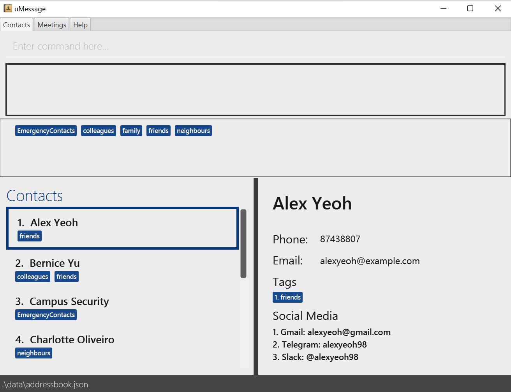

***uMessage*** is a desktop app that helps university students manage contacts, academics and CCAs that communicate and hold meetings on various platforms. It is optimized for keyboard users.

* If you are interested in using uMessage, head over to the [_Quick Start_ section of the **User Guide**](UserGuide.html#quick-start).
* If you are interested about developing uMessage, the [**Developer Guide**](DeveloperGuide.html) is a good place to start.

**Acknowledgements**

* Libraries used: [JavaFX](https://openjfx.io/), [Jackson](https://github.com/FasterXML/jackson), [JUnit5](https://github.com/junit-team/junit5), [MDFX](https://github.com/JPro-one/markdown-javafx-renderer)
